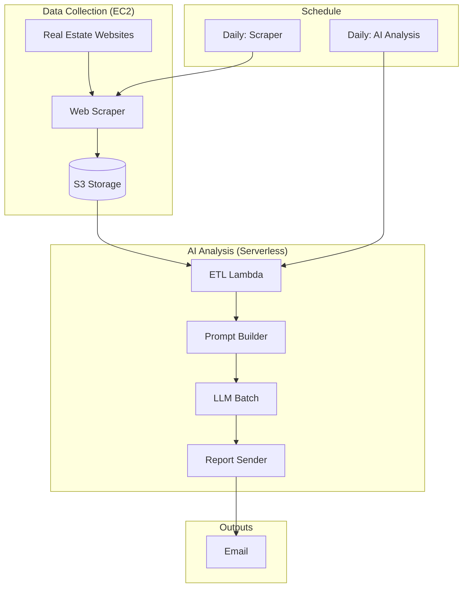

# Tokyo Real Estate Analysis System

A complete real estate analysis pipeline combining web scraping and AI-powered investment analysis for Tokyo properties.

## 🏗️ System Architecture

This repository contains **two complementary systems** that work together:

### 1. Data Collection System (Scraper)
- **Location**: `scraper/` and `ai-infra/`
- **Purpose**: Web scraper that collects daily property data
- **Infrastructure**: EC2-based with CloudFormation deployment
- **Output**: CSV files and property images to S3

### 2. AI Analysis System  
- **Location**: `lambda/`, `ai-infra/`, `stepfunctions/`
- **Purpose**: AI-powered analysis using GPT-4.1 vision
- **Infrastructure**: Serverless (Lambda + Step Functions)
- **Output**: Investment reports via Slack and email

## 📊 Complete Data Flow



## 🚀 Quick Start

### Deploy Data Collection System

```bash
# 1. Deploy scraper infrastructure
cd cf-templates
aws cloudformation create-stack \
  --stack-name scraper-infra \
  --template-body file://infra-stack.yaml \
  --capabilities CAPABILITY_IAM

# 2. Deploy compute
aws cloudformation create-stack \
  --stack-name scraper-compute \
  --template-body file://compute-stack.yaml \
  --parameters ParameterKey=KeyName,ParameterValue=your-key-name
```

### Deploy AI Analysis System

```bash
# Deploy AI analysis pipeline
cd infra
./deploy.sh -e dev -b your-sam-bucket \
  --openai-key sk-your-openai-key \
  --email-from from@yourdomain.com \
  --email-to to@yourdomain.com
```

## 📁 Repository Structure

```
├── scraper/                    # 🕷️ Data Collection System
│   ├── scrape.py              # Main scraper script
│   ├── deploy-*.sh            # Deployment scripts
│   └── README.md              # Scraper documentation
├── cf-templates/              # ☁️ Scraper Infrastructure  
│   ├── infra-stack.yaml       # VPC, security, IAM
│   ├── compute-stack.yaml     # EC2 instance
│   └── README.md              # Infrastructure docs
├── lambda/                    # 🤖 AI Analysis System
│   ├── etl/                   # CSV processing
│   ├── prompt_builder/        # GPT-4.1 vision prompts
│   ├── llm_batch/            # OpenAI Batch API
│   └── report_sender/         # Report generation
├── infra/                     # ☁️ AI Infrastructure
│   ├── ai-stack.yaml          # Serverless infrastructure
│   └── deploy.sh              # AI deployment script
├── stepfunctions/             # 🔄 Workflow Orchestration
│   └── state_machine.asl.json # Step Functions definition
├── tests/                     # 🧪 Test Suite
├── docs/                      # 📚 Documentation
└── .github/workflows/         # 🔄 CI/CD Pipeline
```

## 💰 Cost Analysis

### Daily Operating Costs
| Component | Cost (USD) | Cost (JPY) | Purpose |
|-----------|------------|------------|---------|
| EC2 Scraper (t3.small) | $0.60 | ¥90 | Data collection |
| OpenAI API (Batch) | $1.17 | ¥175 | AI analysis |
| AWS Serverless | $0.02 | ¥3 | Processing |
| **Total Daily** | **$1.79** | **¥268** | Complete pipeline |

## 🎯 Key Features

### Data Collection
- ✅ **Daily Automated Scraping**: Runs on EC2 infrastructure
- ✅ **Stealth Capabilities**: Browser emulation and session management
- ✅ **Image Download**: Property photos with metadata
- ✅ **Data Validation**: Clean CSV output with standardized schema

### AI Analysis  
- ✅ **GPT-4.1 Vision**: Analyzes interior property photos
- ✅ **Investment Scoring**: Ranks properties by investment potential
- ✅ **Risk Detection**: Identifies structural issues in photos
- ✅ **Cost Optimized**: OpenAI Batch API for 50% discount
- ✅ **Email Reports**: Automated email delivery of investment analysis

## 🔧 Development

### Prerequisites
- AWS CLI configured
- AWS SAM CLI (for AI system)
- Docker
- Python 3.12+
- OpenAI API key

### Local Development
```bash
# Install dependencies
make install

# Run tests
make test

# Deploy to development
make deploy-dev BUCKET=... OPENAI_KEY=... SLACK_WEBHOOK=... EMAIL_FROM=... EMAIL_TO=...
```

## 📋 Data Schema

### Scraper Output (CSV)
```csv
id,headline,price_yen,area_m2,year_built,walk_mins_station,ward,photo_filenames
listing1,"Spacious apartment",25000000,65.5,2010,8,Shibuya,"living.jpg|bedroom.jpg"
```

### AI Analysis Output  
```json
{
  "top_picks": [
    {
      "id": "listing1",
      "score": 85,
      "why": "Excellent price per m² in prime location",
      "red_flags": ["Minor wear on floors visible"]
    }
  ],
  "runners_up": [...],
  "market_notes": "Strong demand in central Tokyo"
}
```

## 🔄 Daily Workflow

1. **02:00 JST**: EC2 scraper collects new listings → S3
2. **03:00 JST**: AI analysis processes S3 data → Reports  
3. **03:05 JST**: Reports delivered via Slack + email

## 📚 Documentation

- [System Architecture](docs/architecture.md) - Detailed technical design
- [Cost Analysis](docs/cost.md) - Comprehensive cost breakdown
- [Operations Runbook](docs/runbook.md) - Troubleshooting and maintenance
- [Scraper Documentation](scraper/README.md) - Data collection system
- [Infrastructure Documentation](cf-templates/README.md) - CloudFormation setup

## 🔒 Security

- SSH keys for EC2 access
- OpenAI API keys in SSM Parameter Store
- IAM roles with least-privilege permissions
- VPC isolation for scraper infrastructure

## 📞 Support

For issues with:
- **Data Collection**: Check EC2 instance logs and scraper documentation
- **AI Analysis**: Review CloudWatch logs and Step Functions execution
- **Deployment**: See individual README files in each system directory

---

**Complete Pipeline**: Web Scraping → S3 Storage → AI Analysis → Investment Reports  
**Daily Target Cost**: ~¥268 for full analysis of 100+ properties