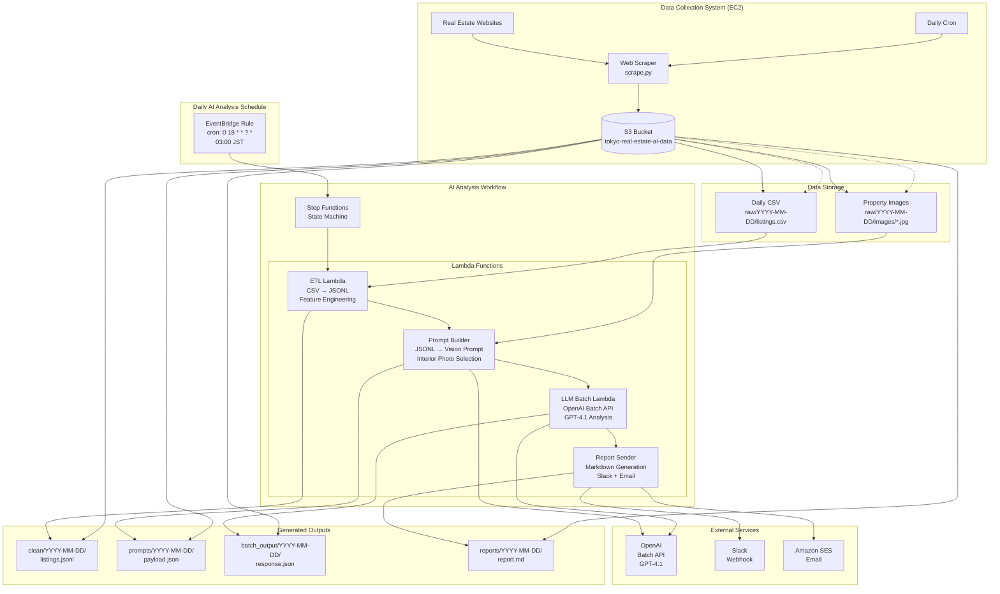

# CLAUDE.md

This file provides guidance to Claude Code (claude.ai/code) when working with code in this repository.

## Repository Overview

This is a Tokyo Real Estate Analysis system combining web scraping and AI-powered investment analysis. The system consists of two complementary subsystems:

1.  **Data Collection System** (`/scraper/`): EC2-based web scraper that collects daily property data
2.  **AI Analysis System** (`/ai-infra/`, `/lambda/`): Serverless pipeline that processes data and generates investment reports using OpenAI GPT-4.1

## System Architecture

## Deployment Best Practices

- **Deployment Guidelines**:
  - We have deploy functions for anything that needs to be deployed. they will give us good logs, always use those, don't deploy manually unless it makes more sense. for example: deploy-ai.sh, deploy-compute.sh, deploy-all.sh.

## Important Principles

- We are ANTI SAM. we do not use SAM ever.

## Regional Configuration

- Remember, never use us-east-1 for anything. everything is in ap-northeast-1, tokyo