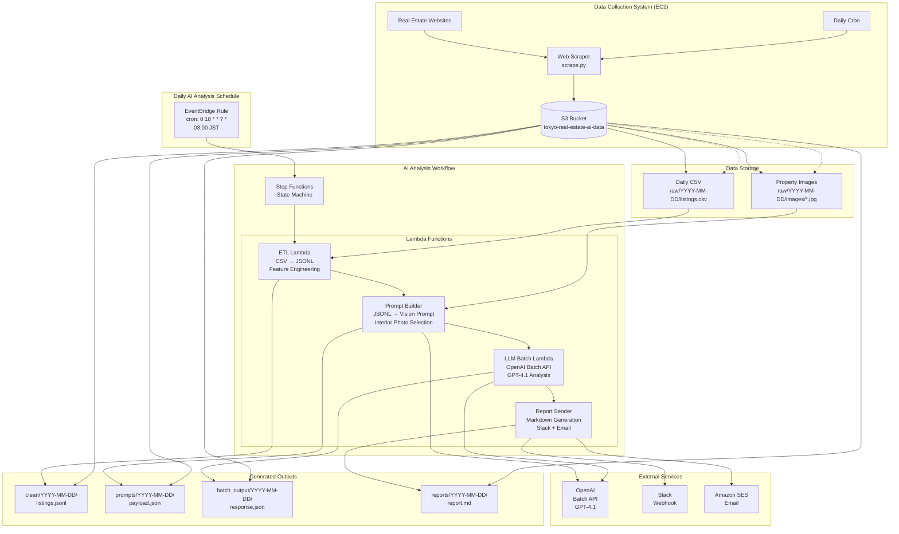

# CLAUDE.md

This file provides guidance to Claude Code (claude.ai/code) when working with code in this repository.

## Repository Overview

This is a Tokyo Real Estate Analysis system combining web scraping and AI-powered investment analysis. The system consists of two complementary subsystems:

1.  **Data Collection System** (`/scraper/`): EC2-based web scraper that collects daily property data
2.  **AI Analysis System** (`/ai-infra/`, `/lambda/`): Serverless pipeline that processes data and generates investment reports using OpenAI GPT-4.1

## System Architecture



### Data Flow
1.  **Web Scraper** (`scraper/scrape.py`) → Daily CSV + Images to S3 (`raw/YYYY-MM-DD/`)
2.  **EventBridge** triggers Step Functions daily at 18:00 UTC (03:00 JST)
3.  **ETL Lambda** (`lambda/etl/`) → Processes CSV to JSONL with computed features
4.  **Prompt Builder Lambda** (`lambda/prompt_builder/`) → Selects top 100 listings, creates GPT-4.1 vision prompts
5.  **LLM Batch Lambda** (`lambda/llm_batch/`) → Submits to OpenAI Batch API, polls for completion
6.  **Report Sender Lambda** (`lambda/report_sender/`) → Generates Markdown reports, sends to Slack + Email

### Key Technologies
-   **Runtime**: Python 3.12 (using a hybrid layer approach)
-   **Orchestration**: AWS Step Functions with retry logic and error handling
-   **Storage**: S3 for all data (raw CSV, processed JSONL, prompts, AI responses, reports)
-   **AI**: OpenAI GPT-4.1 Vision API via Batch API for cost efficiency
-   **Notifications**: Slack webhooks + Amazon SES for email
-   **Infrastructure**: CloudFormation templates in `ai-infra/`

### Lambda Functions Structure
Each Lambda function in `lambda/*/` follows this pattern:
-   `app.py` - Main handler function
-   `requirements.txt` - Dependencies (typically empty, using layers)

### Layer Management (Hybrid Approach)
The system now uses a hybrid layer approach for optimal performance and reliability:

**AWS Prebuilt Layers (90% of dependencies):**
-   pandas, numpy, boto3, pytz, scipy, s3transfer, urllib3
-   Uses: `arn:aws:lambda:ap-northeast-1:336392948345:layer:AWSSDKPandas-Python312:15`
-   Benefits: AWS-managed, tested, optimized, no build time

**Minimal Custom Layer (OpenAI only):**
-   Only contains: openai package and its dependencies
-   Size: ~4MB (vs 500MB+ for previous custom layers)
-   Build time: <1 minute (vs 10+ minutes for Docker builds)
-   Benefits: Fast builds, small deployment packages, easy maintenance

**Custom Layer Version:** `ai-infra/.layer-version` indicates the version of the custom OpenAI layer (e.g., `1.95.0`).

### Configuration Management
-   **Secrets**: OpenAI API key stored in SSM Parameter Store (`/ai-scraper/*/openai-api-key`)
-   **Environment Variables**: Set in CloudFormation template (`ai-infra/ai-stack.yaml`)
-   **Email Configuration**: SES sender/recipient in Lambda environment variables

## Common Development Commands

### Testing
```bash
# Run all tests with coverage
make test

# Run tests with verbose output  
make test-verbose

# Test individual Lambda functions locally
make test-etl-local
make test-prompt-builder-local
make test-llm-batch-local
make test-report-sender-local
```

### Code Quality
```bash
# Run linting checks
make lint

# Format code automatically
make format

# Check formatting without changes
make format-check

# Run type checking
make type-check

# Complete development setup (install + format + lint + type-check + test)
make dev-setup

# Pre-commit checks
make pre-commit
```

### Building and Deployment
```bash
# Build minimal OpenAI layer (replaces heavy custom layers)
mkdir -p openai-layer/python
pip install openai --target openai-layer/python/ --no-cache-dir
zip -r openai-layer.zip openai-layer/ -x "*.pyc" "*/__pycache__/*"

# Package Lambda functions for CloudFormation  
zip -r etl-function.zip lambda/etl/ -x "*.pyc" "*/__pycache__/*"
zip -r prompt-builder-function.zip lambda/prompt_builder/ -x "*.pyc" "*/__pycache__/*"
zip -r llm-batch-function.zip lambda/llm_batch/ -x "*.pyc" "*/__pycache__/*"
zip -r report-sender-function.zip lambda/report_sender/ -x "*.pyc" "*/__pycache__/*"

# Validate CloudFormation template
make validate

# Deploy AI infrastructure
./ai-infra/deploy-ai.sh

# Deploy to development environment
make deploy-dev

# Deploy to production environment  
make deploy-prod
```

### Local Testing
```bash
# Create sample data and test locally (creates mock data)
make local-run DATE=2025-07-07

# Manual execution of specific date through AWS
aws stepfunctions start-execution \
  --state-machine-arn arn:aws:states:REGION:ACCOUNT:stateMachine:STACK-ai-analysis \
  --input '''{"date":"2025-07-07"}'''

# Trigger AI workflow
./ai-infra/trigger_ai_workflow.sh
```

## Scraper System CloudFormation Architecture

The scraper infrastructure uses 3 separate stacks for modularity:

*   **`scraper-infra-stack`** (`scraper/infra-stack.yaml`): Sets up foundational infrastructure like IAM roles, security groups, SNS topics for notifications, and a DynamoDB table for session state management. It also defines a Step Functions state machine for orchestrating stealth scraping sessions.
*   **`scraper-compute-stack`** (`scraper/compute-stack.yaml`): Defines the EC2 instance that runs the scraper. It includes user data to install dependencies, clone the scraper code from GitHub, and configure CloudWatch logging.
*   **`scraper-automation-stack`** (`scraper/automation-stack.yaml`): Defines a Lambda function (`trigger-scraper`) that manages the EC2 instance (starts/stops it) and sends SSM commands to run the scraper. It also sets up EventBridge rules to trigger the scraper in different modes (testing, normal, stealth) on a schedule.

### Scraper Deployment Workflow

*   **Initial Setup**:
    ```bash
    cd scraper/
    ./deploy-all.sh  # Creates all 3 scraper stacks
    ```
*   **Development Cycle (Most Common)**:
    ```bash
    # After updating scraper code in GitHub:
    ./deploy-compute.sh --recreate  # Just recreate EC2 instance (~3 minutes)
    ```
*   **Trigger Scraper Manually**:
    ```bash
    ./trigger_scraper_script.sh
    ```

## Scraper Modes and Configuration

The scraper supports different operational modes, controlled by EventBridge rules and environment variables. All stealth capabilities are integrated into the main stacks with runtime behavior controlled entirely by event payloads.

### Available Modes

*   **Testing Mode**:
    *   **Properties**: Limited to 5 properties
    *   **Areas**: Single area (chofu-city by default)
    *   **Stealth**: Disabled
    *   **Use Case**: Quick testing and validation

*   **Normal Mode**:
    *   **Properties**: Up to 500 properties
    *   **Areas**: Single area (configurable)
    *   **Stealth**: Disabled
    *   **Use Case**: Standard daily scraping

*   **Stealth Mode**:
    *   **Properties**: Up to 10,000 properties
    *   **Areas**: All Tokyo areas with distribution logic
    *   **Stealth**: Enabled with behavioral mimicry
    *   **Use Case**: Production data collection

### Environment Variables Passed to Scraper

The Lambda function sets these environment variables based on the event payload:

*   `MODE`: "testing", "normal", or "stealth"
*   `SESSION_ID`: Unique identifier for the session
*   `MAX_PROPERTIES`: Maximum number of properties to scrape
*   `STEALTH_MODE`: "true" or "false"
*   `ENTRY_POINT`: Entry point for stealth mode
*   `AREAS`: Comma-separated list of areas (for testing/normal modes)

## Cost Analysis

### Daily Cost Breakdown

#### OpenAI API Costs (Primary Driver)

-   **GPT-4.1 Vision Pricing (as of 2024)**:
    -   Input tokens: $2.50 per 1M tokens
    -   Output tokens: $10.00 per 1M tokens
    -   Images: $0.00765 per image (low detail)
-   **Daily Usage Estimate**:
    -   Listings analyzed: 100
    -   Images per listing: ~3
    -   Total images: ~300
    -   **Estimated daily cost (with Batch API 50% discount): $1.17 (~¥175)**

#### AWS Infrastructure Costs

-   **Lambda Functions**: ~$0.19/month
-   **Step Functions**: ~$0.003/month
-   **S3 Storage**: ~$0.002/month
-   **CloudWatch Logs**: ~$0.15/month
-   **Other (SES, EventBridge)**: ~$0.003/month

### Total Daily Cost Summary

| Component          | Daily Cost (USD) | Daily Cost (JPY) |
| ------------------ | ---------------- | ---------------- |
| OpenAI Batch API   | $1.17            | ¥175             |
| AWS Lambda         | $0.006           | ¥1               |
| AWS Other Services | $0.01            | ¥2               |
| **Total Daily**    | **$1.19**        | **¥178**         |
| **Monthly Total**  | **$35.70**       | **¥5,355**       |

## Operations Runbook

### Normal Operation Flow

-   **Trigger**: Daily at 03:00 JST (18:00 UTC) via EventBridge.
-   **Success**: Slack and email notifications are sent by ~04:00 JST.
-   **Health Check**:
    ```bash
    # Check latest Step Functions execution
    aws stepfunctions list-executions --state-machine-arn <YOUR_STATE_MACHINE_ARN> --max-items 1
    # Check S3 for today\'s report
    aws s3 ls s3://tokyo-real-estate-ai-data/reports/$(date +%Y-%m-%d)/
    ```

### Troubleshooting Guide

1.  **Step Functions Execution Failed**:
    -   **Symptom**: No notifications.
    -   **Diagnosis**: Check Step Functions console for the failed step. Review CloudWatch logs for that Lambda function.
    -   **Common Causes**:
        -   **ETL**: Raw CSV file from scraper is missing or malformed.
        -   **LLM Batch**: OpenAI API key is invalid or rate limits were hit.
        -   **Report Sender**: Slack webhook or SES configuration is incorrect.

2.  **High OpenAI Costs**:
    -   **Symptom**: CloudWatch cost alerts triggered.
    -   **Investigation**: Check the `ListingsAnalyzed` and `DailyOpenAICost` custom metrics in CloudWatch.
    -   **Optimization**: Reduce listing count or photos per listing in `lambda/prompt_builder/app.py`.

### Manual Operations

-   **Mode Switching**:
    *   **Switch to Testing Mode**:
        ```bash
        # Disable stealth sessions (example rule names)
        aws events disable-rule --name "stealth-scraper-morning-1"
        # ... disable other stealth rules ...

        # Enable testing session
        aws events enable-rule --name "testing-session-rule"
        ```
    *   **Switch to Normal Mode**:
        ```bash
        # Disable stealth sessions
        aws events disable-rule --name "stealth-scraper-morning-1"
        # ... disable other stealth rules ...

        # Enable normal session
        aws events enable-rule --name "normal-session-rule"
        ```
    *   **Switch to Stealth Mode (Default)**:
        ```bash
        # Enable stealth sessions
        aws events enable-rule --name "stealth-scraper-morning-1"
        # ... enable other stealth rules ...

        # Disable other sessions
        aws events disable-rule --name "testing-session-rule"
        aws events disable-rule --name "normal-session-rule"
        ```

-   **Manual Execution**:
    ```bash
    aws stepfunctions start-execution \
      --state-machine-arn <YOUR_STATE_MACHINE_ARN> \
      --input '''{"date":"YYYY-MM-DD"}'''
    ```

-   **Test Individual Modes (Lambda Invoke)**:
    ```bash
    # Test testing mode
    aws lambda invoke --function-name trigger-scraper \
      --payload '''{"mode": "testing", "single_area": "chofu-city"}''' /tmp/test-response.json

    # Test normal mode  
    aws lambda invoke --function-name trigger-scraper \
      --payload '''{"mode": "normal", "single_area": "shibuya-city"}''' /tmp/normal-response.json

    # Test stealth mode
    aws lambda invoke --function-name trigger-scraper \
      --payload '''{"mode": "stealth", "session_id": "manual-test", "max_properties": 10000}''' /tmp/stealth-response.json
    ```

-   **Emergency Disable**:
    ```bash
    # Disable the daily trigger
    aws events disable-rule --name <YOUR_EVENTBRIDGE_RULE_NAME>
    ```

### Monitoring & Troubleshooting Commands

*   **Check Rule Status**:
    ```bash
    aws events describe-rule --name "<YOUR_EVENTBRIDGE_RULE_NAME>"
    ```
*   **Check Session State (DynamoDB)**:
    ```bash
    aws dynamodb scan --table-name scraper-session-state
    ```
*   **View Lambda Logs**:
    ```bash
    aws logs tail /aws/lambda/trigger-scraper --follow
    ```

## Important Notes

-   **Python Version**: System uses Python 3.12 runtime with compatible layers
-   **OpenAI Costs**: Monitor usage as GPT-4.1 Vision API can be expensive
-   **Secrets Management**: Never commit API keys; use SSM Parameter Store
-   **S3 Structure**: Maintain consistent folder structure (`raw/`, `clean/`, `prompts/`, `batch_output/`, `reports/`)
-   **Two Subsystems**: AI analysis system is independent of the scraper system in `/scraper/`

## Security Practices

-   **IMPORTANT**: We are using AWS secrets to store all API keys/ anything of that nature

## Cleanup and Maintenance Guidelines

-   **Cleanup Procedures**:
    -   Whenever we stop using a file/process... delete it! Delete any unused, unnecessary files you come across as well.
