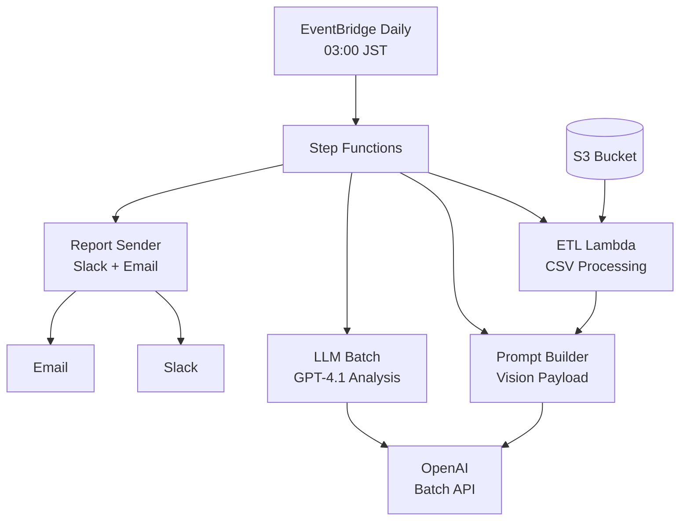

# AI Real Estate Analysis System

A serverless AI-powered system that analyzes Tokyo real estate listings daily using GPT-4.1 vision capabilities to identify the best investment opportunities.

## 🏗️ Architecture

This system processes daily CSV listings and property photos, ranks properties by investment potential using AI analysis, and delivers actionable reports via Slack and email.



## 🚀 Features

- **Daily Automated Analysis**: Runs every day at 03:00 JST
- **AI Vision Analysis**: Uses GPT-4.1 to analyze interior photos for investment risks
- **Smart Filtering**: Processes top 100 properties by price per m²
- **Comprehensive Reports**: Markdown reports with rankings, analysis, and red flags
- **Multi-channel Delivery**: Slack notifications and email reports
- **Cost Optimized**: ~$1.20/day using OpenAI Batch API (50% discount)

## 📊 Expected Daily Costs

| Component | Cost (USD) | Cost (JPY) |
|-----------|------------|------------|
| OpenAI Batch API | $1.17 | ¥175 |
| AWS Services | $0.02 | ¥3 |
| **Total Daily** | **$1.19** | **¥178** |

## 🛠️ Quick Start

### Prerequisites

- AWS CLI configured with appropriate permissions
- AWS SAM CLI installed
- Docker installed and running
- OpenAI API key with GPT-4 access
- Slack webhook URL (optional)
- Verified SES email addresses (optional)

### 1. Clone and Setup

```bash
git clone <repository-url>
cd ai-real-estate-analysis
make install
```

### 2. Deploy to Development

```bash
make deploy-dev \
  BUCKET=your-sam-deployment-bucket \
  OPENAI_KEY=sk-your-openai-key \
  SLACK_WEBHOOK=https://hooks.slack.com/your-webhook \
  EMAIL_FROM=from@yourdomain.com \
  EMAIL_TO=to@yourdomain.com
```

### 3. Manual Test Run

```bash
# Get the Step Functions ARN from deployment output
aws stepfunctions start-execution \
  --state-machine-arn arn:aws:states:region:account:stateMachine:ai-scraper-dev-ai-analysis \
  --name manual-test-$(date +%Y%m%d) \
  --input '{"date":"2025-07-07"}'
```

## 📁 Project Structure

```
├── infra/
│   ├── ai-stack.yaml         # CloudFormation template
│   └── deploy.sh            # Deployment script
├── lambda/
│   ├── etl/                 # CSV processing and feature engineering
│   ├── prompt_builder/      # GPT-4.1 vision prompt creation
│   ├── llm_batch/          # OpenAI Batch API processing
│   └── report_sender/       # Report generation and delivery
├── stepfunctions/
│   └── state_machine.asl.json  # Workflow orchestration
├── tests/                   # Comprehensive test suite
├── docs/                    # Architecture, cost, and operations docs
└── .github/workflows/       # CI/CD pipeline
```

## 🔧 Development

### Local Development

```bash
# Install dependencies
make install

# Run tests
make test

# Lint and format
make lint
make format

# Type checking
make type-check

# Run all pre-commit checks
make pre-commit
```

### Testing

```bash
# Run all tests with coverage
make test

# Run verbose tests
make test-verbose

# Local test simulation
make local-run DATE=2025-07-07
```

### Building and Deployment

```bash
# Validate CloudFormation template
make validate

# Build Docker containers
make build

# Deploy to development
make deploy-dev BUCKET=... OPENAI_KEY=... SLACK_WEBHOOK=... EMAIL_FROM=... EMAIL_TO=...

# Deploy to production
make deploy-prod BUCKET=... OPENAI_KEY=... SLACK_WEBHOOK=... EMAIL_FROM=... EMAIL_TO=...
```

## 📋 Input Data Format

The system expects daily CSV files in S3 with this structure:

```csv
id,headline,price_yen,area_m2,year_built,walk_mins_station,ward,photo_filenames
listing1,"Spacious apartment",25000000,65.5,2010,8,Shibuya,"living_room.jpg|bedroom.jpg|kitchen.jpg"
```

## 📈 Output Reports

The system generates daily reports containing:

- **Top 5 Picks**: Best investment opportunities with scores and reasoning
- **Runners Up**: Additional promising properties
- **Red Flags**: Visible issues identified in photos
- **Market Notes**: Overall market observations

Example output:

```markdown
# Tokyo Real Estate Analysis - 2025-07-07

## 🏆 Top 5 Picks

| Rank | ID | Score | Price (¥) | Area (m²) | Price/m² | Age | Walk (min) |
|------|----|----|----------|-----------|----------|-----|------------|
| 1 | listing1 | 85 | ¥25,000,000 | 65.5 | ¥381,679 | 15 | 8 |

### Detailed Analysis

#### 1. Property listing1 (Score: 85)
**Why**: Excellent price per square meter in desirable Shibuya location
**🚩 Red Flags**: Minor wear visible on hardwood floors
```

## 🔐 Security

- OpenAI API keys stored in SSM Parameter Store (encrypted)
- Slack webhooks stored in SSM Parameter Store (encrypted)
- IAM roles with least-privilege permissions
- No secrets in code or environment variables

## 📊 Monitoring

The system includes:

- CloudWatch metrics for executions, costs, and performance
- Structured logging for debugging
- Automated error notifications
- Cost monitoring and alerts

### Key Metrics

- Daily execution success rate
- OpenAI API costs
- Number of listings processed
- Report delivery success rate

## 🚨 Troubleshooting

### Common Issues

1. **No properties found**: Check CSV data availability and format
2. **OpenAI API errors**: Verify API key and account limits
3. **Step Functions timeout**: Check batch processing duration
4. **Notification failures**: Verify Slack webhook and SES configuration

See [docs/runbook.md](docs/runbook.md) for detailed troubleshooting guide.

## 📚 Documentation

- [Architecture Documentation](docs/architecture.md) - System design and components
- [Cost Analysis](docs/cost.md) - Detailed cost breakdown and optimization
- [Operations Runbook](docs/runbook.md) - Troubleshooting and maintenance

## 🔄 CI/CD

The project includes a comprehensive GitHub Actions workflow:

- Automated testing with pytest and moto
- Code quality checks with ruff and mypy
- Security scanning with Bandit and Semgrep
- Docker container vulnerability scanning
- Automated deployment to development environment

## 📄 License

This project is for educational and personal use. See licensing terms for OpenAI API usage and AWS service costs.

## 🤝 Contributing

1. Fork the repository
2. Create a feature branch
3. Make your changes
4. Run tests: `make test`
5. Run pre-commit checks: `make pre-commit`
6. Submit a pull request

## 📞 Support

For issues and questions:

1. Check the [troubleshooting guide](docs/runbook.md)
2. Review CloudWatch logs for errors
3. Open an issue with detailed error information

---

**Daily Cost Target**: ~¥175 (~$1.20) for analyzing 100 properties with AI vision capabilities