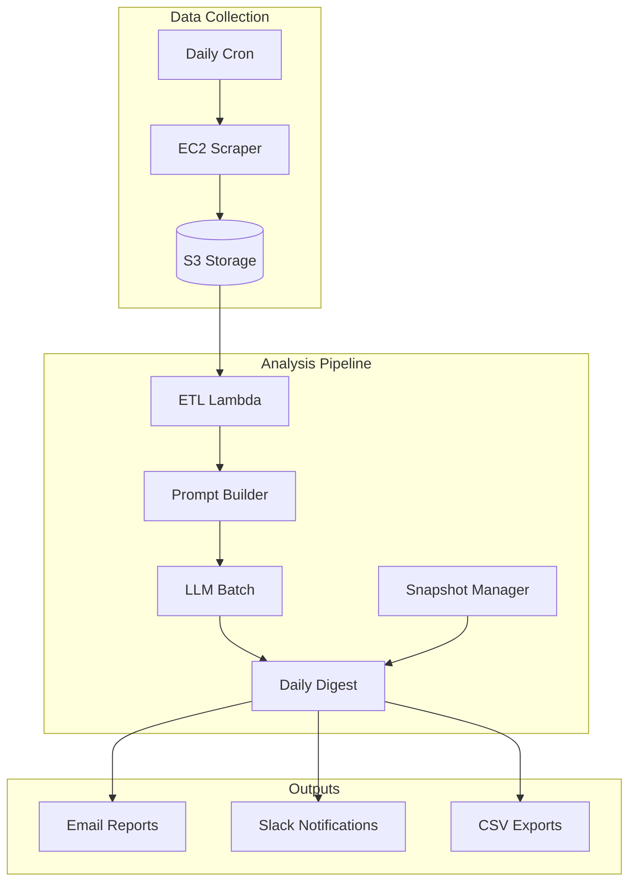

# Tokyo Real Estate Analysis System

A comprehensive AI-powered real estate investment analysis system for Tokyo properties, featuring both legacy and Lean v1.3 modes.

## Overview

This system scrapes, analyzes, and evaluates Tokyo real estate properties using deterministic scoring, AI analysis, and automated reporting. The system operates in two modes:

- **Legacy Mode**: Full AI analysis for all properties
- **Lean Mode v1.3**: Deterministic-first analysis with AI only for gated candidates

## Architecture



## Lean Mode v1.3

### Overview

Lean Mode v1.3 is the **deterministic-first** pipeline that dramatically reduces LLM usage while maintaining analysis quality:

- **Python computes**: Discounts, scores, candidate gating, snapshots, daily digest
- **LLM provides**: Concise qualitative text (3 upsides, 3 risks, justification) for **gated candidates only**
- **Result**: ~80% reduction in LLM costs, deterministic scoring, faster processing

### Environment Variables

Set these environment variables to control system behavior:

```bash
# Master Control
LEAN_MODE=1                    # Enable Lean v1.3 pipeline (default: 0)

# Feature Flags  
LEAN_SCORING=1                 # Enable deterministic scoring (default: 1)
LEAN_PROMPT=1                  # Use lean prompt structure (default: 1)
LEAN_SCHEMA_ENFORCE=1          # Strict JSON schema validation (default: 1)

# Limits
MAX_CANDIDATES_PER_DAY=120     # Maximum candidates to process (default: 120)

# Legacy Settings (used when LEAN_MODE=0)
EMAIL_FROM=alerts@yourcompany.com
EMAIL_TO=team@yourcompany.com
SLACK_WEBHOOK_URL=https://hooks.slack.com/...
```

### Key Differences: Legacy vs Lean

| Feature | Legacy Mode | Lean Mode v1.3 |
|---------|-------------|-----------------|
| **Scoring** | LLM-based subjective | Deterministic Python |
| **Properties Analyzed** | All properties | Gated candidates only (~20%) |
| **LLM Output** | Full reports | 3 upsides + 3 risks + justification |
| **Reports** | Per-property emails | Daily digest email |
| **Comparables** | LLM selection | Filtered ≤8 by algorithm |
| **Images** | All available | ≤3 prioritized |
| **Token Usage** | ~2000+ per property | ~1200 per candidate |
| **Processing Time** | Hours | Minutes |

## Scoring Overview (Lean Mode)

### Scoring Components

The deterministic scoring system uses 6 base components (60 points total):

| Component | Weight | Max Points | Description |
|-----------|---------|------------|-------------|
| **Ward Discount** | 41.7% | 25 | Property price vs ward average |
| **Building Discount** | 16.7% | 10 | Property vs building average |
| **Comps Consistency** | 16.7% | 10 | Comparable sales reliability |
| **Condition** | 11.7% | 7 | Age, renovation, maintenance |
| **Size Efficiency** | 6.7% | 4 | Size appropriateness, layout |
| **Carry Cost** | 6.7% | 4 | Monthly costs vs rental income |

### Add-on Components (15 points total)

- **Price Cut** (5 points): Recent price reductions
- **Renovation Potential** (5 points): Improvement opportunities  
- **Access** (5 points): Transport and walkability

### Adjustments (±25 points)

- **Vision Positive** (0 to +5): Positive factors from images
- **Vision Negative** (0 to -5): Negative factors from images
- **Data Quality Penalty** (0 to -8): Missing critical data
- **Overstated Discount Penalty** (0 to -8): Suspicious pricing

### Gating Rules

Properties are categorized based on final score and ward discount:

- **BUY_CANDIDATE**: `final_score ≥ 75` AND `ward_discount ≤ -12%` AND `dq_penalty ≥ -4`
- **WATCH**: `final_score 60-74` OR `ward_discount -8% to -11.99%`
- **REJECT**: Everything else

## Usage Examples

### Basic Scoring

```python
from analysis.lean_scoring import score_property

property_data = {
    'price': 50000000,
    'size_sqm': 60,
    'price_per_sqm': 833333,
    'ward_avg_price_per_sqm': 1100000,
    'building_avg_price_per_sqm': 950000,
    'building_age_years': 8,
    'maintenance_grade': 'A'
}

score, verdict, report = score_property(property_data)
print(f"Score: {score:.1f}, Verdict: {verdict.value}")
```

### Finding Comparables

```python
from analysis.comparables import find_and_format_comparables

target_property = {
    'price_per_sqm': 900000,
    'size_sqm': 55.0,
    'building_age_years': 10
}

comps, comp_text, market_stats = find_and_format_comparables(
    target_property, all_properties, max_comps=8
)

print(f"Found {market_stats['num_comparables']} comparables")
print(comp_text)
```

### Generating Daily Digest

```python
from notifications.daily_digest import generate_daily_digest

# Generate HTML + CSV digest
digest_package = generate_daily_digest(candidates, market_snapshots)

print(f"Generated digest for {digest_package['candidate_count']} candidates")
with open('daily_digest.html', 'w') as f:
    f.write(digest_package['html'])
```

## Deployment

### Prerequisites

- AWS CLI configured for `ap-northeast-1` (Tokyo region)
- Python 3.9+
- Required IAM permissions for Lambda, S3, DynamoDB, SES

### Deploy Infrastructure

```bash
# Deploy scraping infrastructure
cd scraper/
./deploy-compute.sh

# Deploy AI analysis pipeline  
cd ../ai-infra/
./deploy-ai.sh

# Deploy everything
./deploy-all.sh
```

### Region Requirement

⚠️ **Important**: This system **must** be deployed in `ap-northeast-1` (Tokyo) region only.

```bash
export AWS_DEFAULT_REGION=ap-northeast-1
```

## File Structure

```
├── analysis/                 # Deterministic analysis modules
│   ├── lean_scoring.py      # Scoring engine
│   ├── comparables.py       # Comparable selection
│   └── vision_stub.py       # Image analysis helpers
├── notifications/            # Reporting and alerts
│   ├── daily_digest.py      # HTML/CSV digest generation
│   └── notifier.py          # Slack/email notifications
├── snapshots/               # Market snapshot utilities
│   └── snapshot_manager.py  # Global/ward statistics
├── schemas/                 # JSON schemas
│   ├── evaluation_min.json  # Lean LLM output schema
│   └── models.py            # Data models
├── ai-infra/                # Serverless AI pipeline
│   ├── lambda/              # Lambda functions
│   │   ├── etl/             # Data normalization + scoring
│   │   ├── prompt_builder/  # Lean prompt assembly
│   │   ├── llm_batch/       # LLM API calls
│   │   └── report_sender/   # Email/Slack delivery
│   └── deploy-ai.sh         # Deployment script
├── scraper/                 # Data collection (EC2)
│   ├── scrape.py            # Property scraping
│   └── deploy-compute.sh    # EC2 deployment
├── tests/                   # Test suite
│   ├── fixtures/            # Test data
│   └── test_*.py           # Test modules
└── examples/               # Sample outputs
```

## Testing

Run the complete test suite:

```bash
# Install test dependencies
pip install -r tests/requirements.txt

# Run all tests
pytest tests/ -v

# Run specific test categories
pytest tests/test_scoring_basic.py -v      # Scoring tests
pytest tests/test_comparables_basic.py -v  # Comparables tests
pytest tests/test_digest.py -v             # Digest tests
```

### Test Coverage

The test suite covers:

- **Scoring correctness**: Ward discount linearity, DQ penalties, component weights
- **Comparables filtering**: Price/size/age filters, ≤8 results, proper sorting
- **Prompt assembly**: Structure validation, image limits, token estimation
- **Schema validation**: JSON schema compliance, field constraints
- **Digest generation**: HTML structure, CSV format, data accuracy

## Monitoring and Metrics

### Key Metrics (Lean Mode)

Track these metrics for system health:

- `PropertiesProcessed`: Total properties analyzed per day
- `CandidatesEnqueued`: Properties meeting gating criteria
- `CandidatesSuppressed`: Properties rejected by gating
- `LLM.Calls`: Actual LLM API calls made
- `Evaluator.SchemaFail`: LLM outputs failing schema validation
- `Digest.Sent`: Daily digest emails delivered

### Monitoring Queries

```bash
# Check daily processing stats
aws logs filter-log-events \
  --log-group-name /aws/lambda/ai-stack-etl \
  --start-time $(date -d '1 day ago' +%s)000 \
  --filter-pattern "PropertiesProcessed"

# Monitor LLM usage
aws logs filter-log-events \
  --log-group-name /aws/lambda/ai-stack-llm-batch \
  --start-time $(date -d '1 day ago' +%s)000 \
  --filter-pattern "LLM.Calls"
```

## Troubleshooting

### Common Issues

**1. No candidates found**
- Check gating criteria are not too strict
- Verify ward discount calculations
- Ensure market data is current

**2. LLM schema validation failures**
- Review `evaluation_min.json` schema
- Check prompt instructions are clear
- Consider retry logic for failed validations

**3. Digest email not sent**
- Verify SES configuration in Tokyo region
- Check email addresses are verified
- Review IAM permissions for SES

**4. High LLM costs**
- Ensure `LEAN_MODE=1` is set
- Monitor candidate gating ratios
- Check image prioritization is working

### Rollback to Legacy Mode

If needed, rollback to legacy mode:

```bash
# Set environment variable
export LEAN_MODE=0

# Redeploy with legacy configuration
./deploy-ai.sh
```

## Contributing

### Development Setup

```bash
# Clone repository
git clone <repository-url>
cd scraper/

# Install dependencies
pip install -r requirements.txt
pip install -r tests/requirements.txt

# Run tests to verify setup
pytest tests/ -v
```

### Code Style

- Follow PEP 8 for Python code
- Use type hints where appropriate
- Document functions with docstrings
- Write tests for new functionality

### Lean Mode Guidelines

When working on Lean Mode v1.3:

- **DO NOT** re-introduce "send every listing to the LLM"
- **Honor feature flags** and route through deterministic modules
- **Touch only relevant paths** unless explicitly requested
- **Emit minimal metrics** listed in Lean v1.3 spec
- **Truncate logged prompts/outputs** >1500 characters

## License

Internal company use only. See LICENSE file for details.

## Support

For support and questions:
- Technical issues: Create GitHub issue
- System alerts: Check #real-estate-alerts Slack channel  
- Architecture questions: Contact the development team