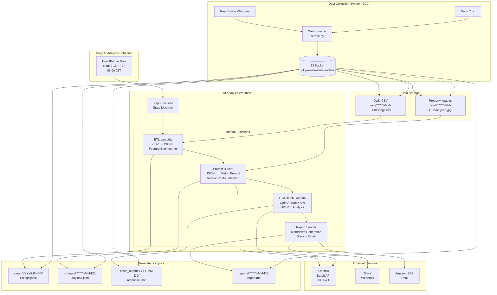

# Tokyo Real Estate Analysis - Complete System Architecture

## Overview

The Tokyo Real Estate Analysis system is a complete pipeline combining web scraping and AI-powered investment analysis. It consists of two complementary subsystems:

1. **Data Collection System**: EC2-based web scraper that collects daily property data
2. **AI Analysis System**: Serverless AI pipeline that processes the data and generates investment reports

This document focuses on the AI Analysis subsystem architecture. For scraper system details, see `/scraper/README.md`.

## Complete System Architecture



## Component Details

### 1. EventBridge Schedule
- **Trigger**: Daily at 18:00 UTC (03:00 JST)
- **Purpose**: Initiates the AI analysis workflow
- **Input**: Current timestamp

### 2. ETL Lambda Function
- **Runtime**: Python 3.12 in Docker container
- **Memory**: 1024 MB
- **Timeout**: 15 minutes
- **Purpose**: 
  - Reads daily CSV from S3
  - Computes `price_per_m2` and `age_years`
  - Categorizes photos as interior/exterior
  - Generates S3 URLs for photos
  - Outputs JSONL format

### 3. Prompt Builder Lambda
- **Runtime**: Python 3.12 in Docker container
- **Memory**: 1024 MB  
- **Timeout**: 15 minutes
- **Purpose**:
  - Sorts listings by `price_per_m2` (ascending)
  - Selects top 100 listings
  - Creates GPT-4.1 vision prompt with interior photos
  - Generates presigned URLs (8h expiry)
  - Saves OpenAI API payload

### 4. LLM Batch Lambda
- **Runtime**: Python 3.12 in Docker container
- **Memory**: 1024 MB
- **Timeout**: 60 minutes
- **Purpose**:
  - Creates OpenAI Batch job
  - Polls for completion (with Lambda timeout protection)
  - Downloads and parses results
  - Saves analysis results

### 5. Report Sender Lambda
- **Runtime**: Python 3.12 in Docker container
- **Memory**: 1024 MB
- **Timeout**: 15 minutes
- **Purpose**:
  - Generates Markdown report
  - Sends to Slack via webhook
  - Sends email via SES
  - Handles cases with zero picks

### 6. Step Functions State Machine
- **Purpose**: Orchestrates the workflow with error handling
- **Features**:
  - Retry logic with exponential backoff
  - Error states for debugging
  - JSONPath data passing between steps
  - Timeout management

## Data Flow

### Input Data Structure
```csv
id,headline,price_yen,area_m2,year_built,walk_mins_station,ward,photo_filenames
listing1,"Spacious apartment",25000000,65.5,2010,8,Shibuya,"living_room.jpg|bedroom.jpg|kitchen.jpg"
```

### Processed JSONL Format
```json
{
  "id": "listing1",
  "headline": "Spacious apartment in Shibuya",
  "price_yen": 25000000,
  "area_m2": 65.5,
  "price_per_m2": 381679.39,
  "age_years": 15,
  "walk_mins_station": 8.0,
  "ward": "Shibuya",
  "photo_urls": ["s3://bucket/raw/2025-07-07/images/living_room.jpg"],
  "interior_photos": ["s3://bucket/raw/2025-07-07/images/living_room.jpg"],
  "photo_count": 3,
  "interior_photo_count": 3
}
```

### GPT-4.1 Analysis Output
```json
{
  "top_picks": [
    {
      "id": "listing1",
      "score": 85,
      "why": "Excellent price per square meter in desirable location",
      "red_flags": ["Minor wear on floors visible in photos"]
    }
  ],
  "runners_up": [...],
  "market_notes": "Strong market conditions observed"
}
```

## Security & IAM

### Lambda Execution Role Permissions
- **S3**: GetObject, PutObject, ListBucket on `tokyo-real-estate-ai-data` bucket
- **SSM**: GetParameter for OpenAI API key and Slack webhook
- **SES**: SendEmail, SendRawEmail for notifications

### Secrets Management
- OpenAI API key stored in SSM Parameter Store (SecureString)
- Slack webhook URL stored in SSM Parameter Store (SecureString)
- No secrets in environment variables or code

### Network Security
- Lambdas run outside VPC (no VPC configuration needed)
- S3 access via AWS SDK with IAM roles
- HTTPS-only external API calls

## Monitoring & Observability

### CloudWatch Metrics
- Lambda duration, errors, invocations
- Step Functions execution success/failure rates
- Custom metrics for listings processed, photos analyzed

### CloudWatch Logs
- Structured logging in all Lambda functions
- Request/response logging for external API calls
- Error details with stack traces

### Alarms (Recommended)
- Step Functions execution failures
- Lambda function errors
- OpenAI API rate limit errors
- SES bounce rates

## Scalability Considerations

### Current Limits
- 100 listings per analysis (configurable)
- 20 photos per listing (GPT-4.1 limit)
- Single daily execution

### Scaling Options
- Increase listing limit (affects cost)
- Parallel processing for multiple markets
- Real-time processing with SQS/SNS triggers
- Multi-region deployment

## Dependencies

### External Services
- **OpenAI Batch API**: GPT-4.1 vision model
- **Slack**: Webhook notifications
- **Amazon SES**: Email delivery

### AWS Services
- Lambda (compute)
- Step Functions (orchestration)
- S3 (storage)
- EventBridge (scheduling)
- SSM Parameter Store (secrets)
- CloudWatch (monitoring)

## Deployment

### Infrastructure as Code
- CloudFormation template: `infra/ai-stack.yaml`
- Container images built and pushed to ECR
- Parameterized for different environments

### CI/CD Pipeline
- GitHub Actions workflow
- Automated testing with pytest
- Linting with ruff and mypy
- Deploy to dev on main branch pushes