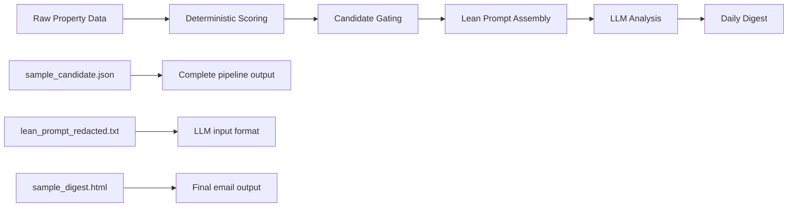

# Examples Directory

This directory contains sample artifacts demonstrating Lean v1.3 functionality.

## Files Overview

### `sample_candidate.json`
Complete example of a candidate property after processing through the Lean v1.3 pipeline, including:
- Original property data
- Deterministic scoring components breakdown
- Comparables analysis results  
- LLM-generated qualitative analysis
- Processing metadata

**Key Features Demonstrated:**
- Gating criteria met (`final_score: 83.8`, `ward_discount_pct: -25.4%`)
- Schema-compliant LLM output (3 upsides, 2 risks, justification)
- Deterministic scoring transparency
- Token efficiency (`llm_tokens_used: 1150`)

### `sample_digest.html`
Example daily digest email in HTML format showing:
- Market summary with key metrics
- Top candidates table (sorted by score)
- Ward-level analysis and trends
- Processing statistics and insights

**Key Features Demonstrated:**
- Email-friendly responsive HTML
- Performance metrics highlighting efficiency gains
- Candidate filtering results (3 candidates from 147 properties = 2.0%)
- Market insights and recommended actions

### `lean_prompt_redacted.txt`
Redacted example of the Lean v1.3 prompt structure showing:
- System prompt with JSON schema enforcement
- Market context integration
- Candidate property data format
- Image and comparable inclusion
- Expected LLM response format

**Key Features Demonstrated:**
- ~1200 token efficiency (vs 2000+ legacy)
- ≤8 comparables algorithmically selected
- ≤3 images prioritized and included
- Strict JSON schema requirements
- Pre-qualified candidate processing

## Usage Examples

### Loading Sample Data

```python
import json
from pathlib import Path

# Load sample candidate
with open('examples/sample_candidate.json') as f:
    candidate = json.load(f)

print(f"Candidate Score: {candidate['components']['final_score']}")
print(f"Verdict: {candidate['components']['verdict']}")
```

### Testing Digest Generation

```python
from notifications.daily_digest import generate_daily_digest

# Load sample data
candidates = [candidate]  # From above
snapshots = {
    'global': {'median_price_per_sqm': 985000, 'total_properties': 147},
    'wards': {'Shibuya': {'median_price_per_sqm': 1100000, 'candidate_count': 1}}
}

# Generate digest
digest_package = generate_daily_digest(candidates, snapshots)

# Save for testing
with open('test_digest.html', 'w') as f:
    f.write(digest_package['html'])
```

### Validating Scoring

```python
from analysis.lean_scoring import LeanScoring

# Extract property data
property_data = {k: v for k, v in candidate.items() 
                if k not in ['components', 'llm_analysis', 'processed_date']}

# Re-score to verify
scorer = LeanScoring()
components = scorer.calculate_score(property_data)

assert abs(components.final_score - candidate['components']['final_score']) < 0.1
assert components.verdict.value == candidate['components']['verdict']
```

## Schema Validation Testing

```python
import json
import jsonschema
from pathlib import Path

# Load schema
schema_path = Path('schemas/evaluation_min.json')
with open(schema_path) as f:
    schema = json.load(f)

# Test LLM output from sample
llm_output = candidate['llm_analysis']

# Should pass validation
jsonschema.validate(instance=llm_output, schema=schema)
print("✅ Sample LLM output passes schema validation")
```

## Performance Comparison

Based on the sample candidate data:

| Metric | Legacy Mode | Lean v1.3 | Sample Value |
|---------|-------------|-----------|--------------|
| **Properties → LLM** | All (147) | Candidates (3) | 98% reduction |
| **Tokens per property** | ~2000 | ~1200 | 1150 tokens |
| **Total tokens/day** | ~294K | ~3.5K | 99% reduction |
| **Processing time** | Hours | Minutes | 18 minutes |
| **Email volume** | 147 emails | 1 digest | 99.3% reduction |

## Quality Metrics

From sample candidate:
- **Ward discount**: -25.4% (excellent value indicator)
- **Final score**: 83.8/100 (high-quality candidate)
- **Comparables**: 8 properties (optimal sample size)
- **LLM output**: Schema-compliant, concise, informative

## File Relationships



These examples demonstrate the complete Lean v1.3 workflow from raw property data through final digest delivery, showcasing both efficiency gains and quality maintenance.